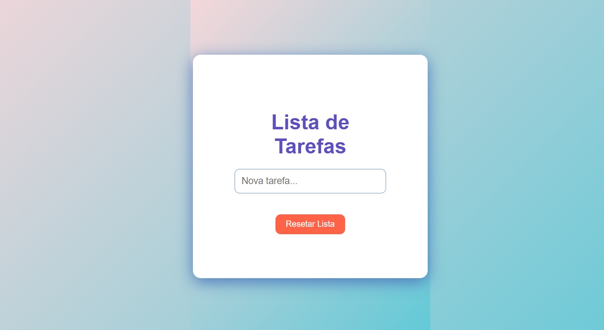

# Lista de Tarefas (To-Do List)



## Demo ao Vivo
[Ver projeto funcionando](https://mbarros-ux.github.io/Lista-de-tarefas/)

## Sobre
Aplicação de lista de tarefas (To-Do List) desenvolvida com JavaScript puro para praticar manipulação do DOM e gerenciamento de estado. O projeto permite adicionar, marcar como concluída e remover tarefas, com armazenamento local no navegador.

Este projeto foi criado para aprender conceitos de CRUD (Create, Read, Update, Delete) e manipulação dinâmica de elementos HTML.

## Tecnologias Utilizadas
- JavaScript - Lógica da aplicação e manipulação do DOM
- HTML5 - Estrutura semântica
- CSS3 - Estilização e animações
- LocalStorage - Persistência de dados no navegador

## Funcionalidades
- Adicionar novas tarefas
- Marcar tarefas como concluídas
- Remover tarefas individualmente
- Armazenamento local (dados persistem após fechar o navegador)
- Interface limpa e intuitiva
- Layout responsivo
- Animações CSS suaves
- Contador de tarefas pendentes

## Como Executar

1. Clone este repositório:
```bash
git clone https://github.com/mbarros-ux/Lista-de-tarefas.git
```
 2. Abra o arquivo ```index.html``` em seu navegador.
